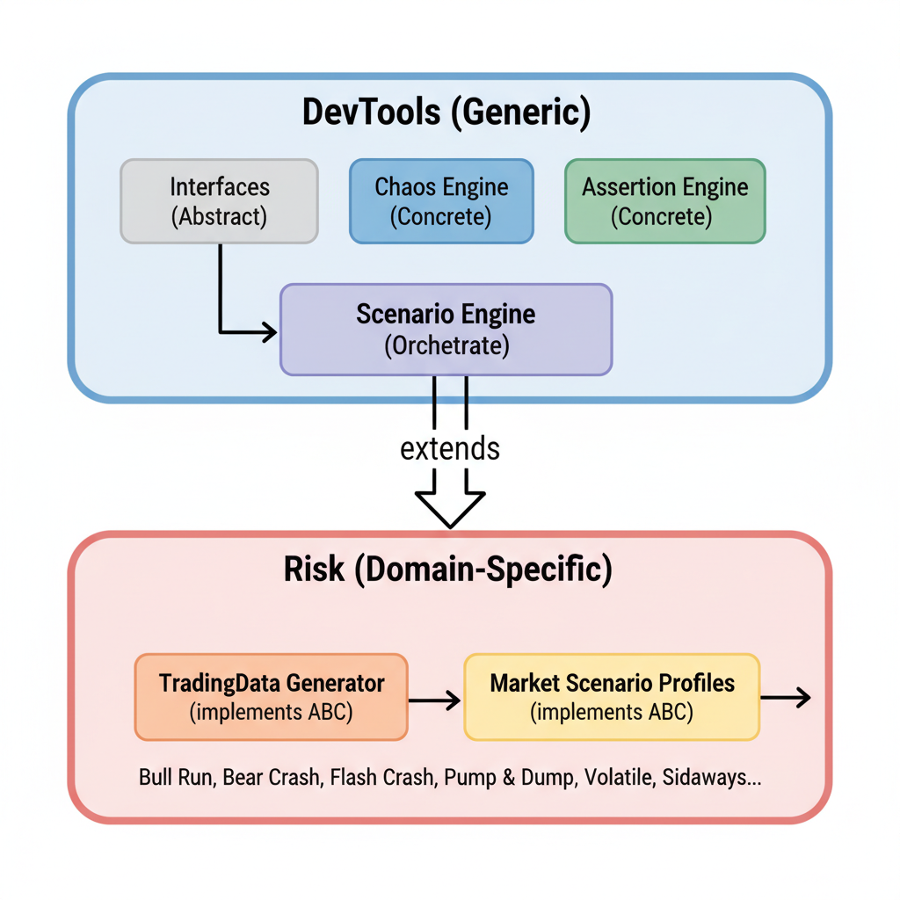

# Migration Summary: Scenario Engine

## Overview

Successfully migrated and refactored `mock_exchange` and `scenario_testing` from the Risk project into a **generic, domain-agnostic scenario testing framework** in
DevTools, with trading-specific implementations remaining in the Risk project.

## What Was Accomplished

### 1. Generic Scenario Engine in DevTools ✅

Created a complete generic framework in `/src/python_pubsub_devtools/scenario_engine/`:

#### Core Interfaces (`interfaces.py`)

- `DataGenerator` (ABC): Abstract interface for generating domain-specific data
- `ScenarioProfile` (ABC): Abstract interface for defining behavior patterns
- `MultiPhaseScenarioProfile`: Base class for multi-phase scenarios
- `GeneratedData`: Generic container for generated data
- `ScenarioPhase` (Enum): Common phase types

#### Chaos Engineering (`chaos_injector.py`)

- `ChaosInjector`: Main chaos orchestration class
- `ChaosAction` (ABC): Base class for chaos actions
- `DelayEvent`: Delay event publication
- `DropEvent`: Drop/prevent event publication
- `ModifyEvent`: Modify event data using dot-notation paths
- `InjectFailureEvent`: Inject failure events

**Key Features:**

- Wraps any service bus with `publish()` method
- Configurable triggers (cycle, event, probability)
- Event history tracking
- Statistics reporting

#### Assertion Framework (`assertion_checker.py`)

- `AssertionChecker`: Main assertion orchestration class
- `Assertion` (ABC): Base class for assertions
- `AssertionResult`: Result container
- `EventCountAssertion`: Count-based assertions (min, max, exact)
- `EventSequenceAssertion`: Order-based assertions
- `NoEventAssertion`: Negative assertions (event should NOT occur)
- `CustomAssertion`: User-defined assertion functions

**Key Features:**

- Works with generic event dictionaries
- Human-readable reports
- Detailed failure messages
- Composable assertions

#### Orchestration Engine (`scenario_engine.py`)

- `ScenarioEngine`: Main orchestration class
- `ScenarioStep`: Declarative step definition
- `StepType` (Enum): Step types (WAIT_CYCLES, WAIT_EVENT, RUN_ASSERTIONS, EXECUTE_ACTION, GENERATE_DATA)

**Key Features:**

- Declarative scenario definition
- Automatic event recording
- Chaos injection integration
- Assertion checking integration
- Comprehensive reporting
- Lifecycle management (setup, run, teardown)

### 2. Trading-Specific Implementations in Risk ✅

Created domain-specific implementations in `/Python.PubSub.Risk/python_pubsub_risk/scenario_testing/`:

#### Trading Data Generator (`trading_data_generator.py`)

- `TradingDataGenerator`: Extends `DataGenerator` for market data
- Generates realistic prices with bid/ask spread
- Configurable volatility
- Trading-specific statistics (price change %, min/max, range)

#### Market Scenario Profiles (`market_scenarios.py`)

- `BullRunProfile`: Steadily increasing prices
- `BearCrashProfile`: Steadily decreasing prices
- `SidewaysMarketProfile`: Consolidation with oscillation
- `VolatileMarketProfile`: High volatility with large swings
- `FlashCrashProfile`: Multi-phase crash and recovery
- `PumpAndDumpProfile`: Multi-phase pump and dump pattern
- `GradualTrendProfile`: Configurable trend direction and speed

#### Example Usage (`example_usage.py`)

Complete examples demonstrating:

- Basic scenario execution
- Chaos injection with trading scenarios
- Custom trading assertions
- Multi-phase scenarios
- Assertion validation

### 3. Package Updates ✅

#### DevTools Updates

- **`__init__.py`**: Added `scenario_engine` module export
- **`pyproject.toml`**:
    - Updated version to `0.2.0`
    - Updated description to include "Scenario Testing with Chaos Engineering"
- **`scenario_engine/__init__.py`**: Clean module exports with all components

#### Risk Updates

- **`scenario_testing/__init__.py`**: Exports all trading-specific components

## Architecture Highlights

### Clean Separation of Concerns

<p align="center">
  
</p>

### Key Design Principles Applied

1. **Dependency Injection**: All domain logic injected via interfaces
2. **Open/Closed Principle**: Generic framework closed for modification, open for extension
3. **Single Responsibility**: Each class has one clear purpose
4. **Interface Segregation**: Small, focused interfaces
5. **Dependency Inversion**: Generic code depends on abstractions, not concrete implementations

## Usage Example

```python
from python_pubsub_devtools.scenario_engine import (
    ScenarioEngine,
    ScenarioStep,
    StepType,
    EventCountAssertion,
    DelayEvent
)
from python_pubsub_risk.scenario_testing import (
    TradingDataGenerator,
    FlashCrashProfile
)

# Create trading-specific generator
profile = FlashCrashProfile(
    base_price=100.0,
    crash_severity=0.30,
    crash_duration=5,
    recovery_duration=20
)

generator = TradingDataGenerator(
    scenario_profile=profile,
    initial_price=100.0,
    volatility=0.02
)

# Create generic engine
engine = ScenarioEngine(
    generator=generator,  # Injected dependency
    service_bus=my_service_bus,
    enable_chaos=True
)

# Add chaos
engine.chaos_injector.add_action(
    DelayEvent("PriceUpdate", delay_ms=5000, at_cycle=15)
)

# Define scenario (declarative)
scenario = [
    ScenarioStep(StepType.WAIT_CYCLES, name="Normal phase", cycles=10),
    ScenarioStep(StepType.WAIT_CYCLES, name="Crash phase", cycles=5),
    ScenarioStep(StepType.WAIT_CYCLES, name="Recovery phase", cycles=20),
    ScenarioStep(
        StepType.RUN_ASSERTIONS,
        name="Verify recovery",
        assertions=[EventCountAssertion("PriceUpdate", min_count=35)]
    )
]

# Run scenario
report = engine.run_scenario(scenario, context={"name": "Flash Crash Test"})
engine.print_report(report)
```

## Benefits of This Architecture

### For DevTools Users

- ✅ Generic framework works with **any** domain (not just trading)
- ✅ No trading-specific code polluting the library
- ✅ Clean, documented interfaces for extension
- ✅ Complete chaos engineering and assertion framework
- ✅ Reusable for sensor data, network traffic, user behavior, etc.

### For Risk Project

- ✅ Trading-specific code stays in domain project
- ✅ Clean separation from infrastructure
- ✅ Easy to create new market scenarios
- ✅ Extensive scenario library (7 profiles included)
- ✅ Complete examples and documentation

### For Testing

- ✅ Declarative scenario definitions
- ✅ Chaos injection for resilience testing
- ✅ Comprehensive assertion framework
- ✅ Detailed execution reports
- ✅ Easy to reproduce test scenarios

## Files Created

### DevTools

```
src/python_pubsub_devtools/scenario_engine/
├── __init__.py                 # Module exports
├── README.md                   # Comprehensive documentation
├── interfaces.py               # Abstract base classes (209 lines)
├── chaos_injector.py           # Chaos engineering (320 lines)
├── assertion_checker.py        # Assertion framework (353 lines)
└── scenario_engine.py          # Orchestration engine (441 lines)
```

### Risk

```
python_pubsub_risk/scenario_testing/
├── __init__.py                      # Module exports
├── trading_data_generator.py       # Trading data generator (124 lines)
├── market_scenarios.py             # Market scenario profiles (412 lines)
└── example_usage.py                # Complete examples (352 lines)
```

### Documentation

```
MIGRATION_SUMMARY.md                 # This file
```

## Next Steps

### For Further Development

1. **Add More Scenario Profiles** (Risk):
    - Support/Resistance scenarios
    - Liquidity events
    - Correlation scenarios

2. **Add Domain-Specific Assertions** (Risk):
    - Price range assertions
    - Volatility assertions
    - Trading pattern assertions

3. **Add More Chaos Actions** (DevTools):
    - ReorderEvents
    - DuplicateEvent
    - CorruptEvent

4. **Integration with Tests**:
    - Use in Risk project tests
    - Create scenario test suites
    - Document testing patterns

### For Other Domains

The framework is ready to be extended for other domains:

1. Create domain-specific `DataGenerator`
2. Create domain-specific `ScenarioProfile` implementations
3. Use generic `ScenarioEngine` as-is
4. Add domain-specific assertions if needed

## Testing

To verify the implementation:

```bash
# In Risk project
cd /home/rvv/PycharmProjects/venantvr-trading/Python.PubSub.Risk
python -m python_pubsub_risk.scenario_testing.example_usage
```

Expected output: 4 example scenarios run successfully with detailed reports.

## Version Updates

- **DevTools**: `0.1.0` → `0.2.0` (new scenario engine feature)
- **Risk**: No version change (internal refactoring only)

## Breaking Changes

None - this is all new functionality. Existing DevTools functionality (Event Flow, Event Recorder) remains unchanged.

## Conclusion

Successfully created a **clean, generic, domain-agnostic scenario testing framework** with:

- ✅ Strong separation of concerns
- ✅ Proper dependency injection
- ✅ Comprehensive chaos engineering
- ✅ Flexible assertion framework
- ✅ Complete documentation
- ✅ Real-world trading examples

The framework is production-ready and can be extended to any domain that needs scenario-based testing of event-driven systems.
